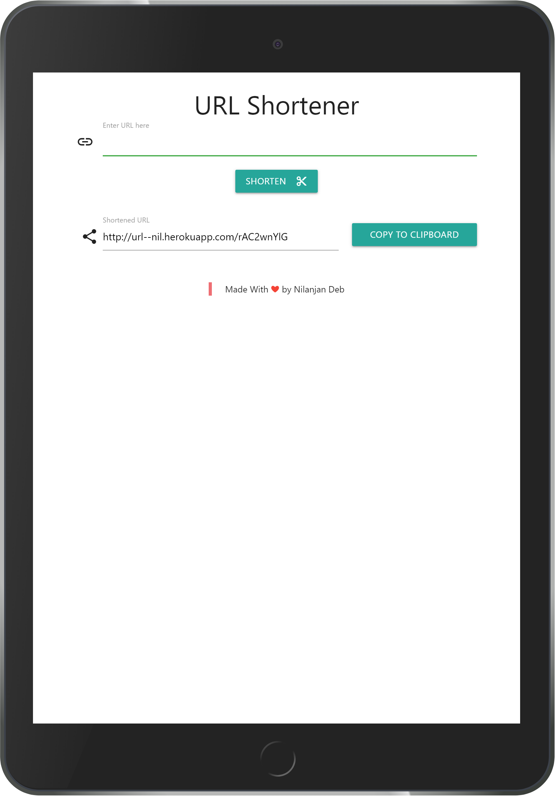

# URL Shortener
* #### URL shortner made using NodeJS and MongoDB served over Heroku. [Check here](https://url--nil.herokuapp.com/).

* #### Github Repository Link [here](https://github.com/nil1729/url-shortner-nodejs).

---

## Website Preview 
* 

---

## Setup Locally

#### Prerequisites

* [MongoDB](https://www.mongodb.com/cloud/atlas).
* [Node JS](https://nodejs.org/).
* [React JS](https://reactjs.org/).

#### Instructions

```
>> git clone https://github.com/nil1729/url-shortner-nodejs.git
>> cd url-shortner-nodejs
>> npm install 
```
#### In `config` directory
* Create a `default.json` file.
* Add your `MongoDB Atlas` credentials in `"mongoURI"` field.
```
{
    "mongoURI": ""
}   
```
* [Here is [the Video](https://www.youtube.com/watch?v=KKyag6t98g8) Tutorial for how to create MongoDB Atlas account and connect to NodeJS application].

---

<p style="text-align: center;">Made With<span style="color: red;"> &#10084; </span>by <a href="https://github.com/nil1729" target="_blank"> Nilanjan Deb </a> </p>
